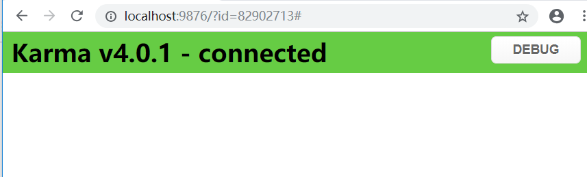

前面已经学些了如何使用mocha和chai断言库写测试，但是有一个问题，就是我们每次写完测试代码，都要手动执行mocha命令来跑测试，有没有办法自动跑测试代码呢，当然是有的，这时候就要借助我们神奇的测试运行工具karma了，有了karam的帮助，就可以自动跑测试代码，而不需要我们每次手动执行命令了
* 全局安装karma脚手架`npm install karma-cli -g`
* 初始化node项目`npm init`
* 安装karma和mocha, `npm install karam mocha --save-dev`
* 安装chai断言库, `npm install chai --save-dev`
* karma init 生成karma的配置文件karma.conf.js(注意这条命令在git bash的环境会回报错，因此windows系统用cmd窗口, linux系统用shell, 报错原因有兴趣的可以去看看[这里](https://github.com/karma-runner/karma/issues/1724), 在生成配置文件的时候， 测试框架我们选mocha, 浏览器选chrome
* mkdir test
* cd test
* touch test.js
内容如下, 测试文件已经写好了，我们来看看如何跑通这个测试
```javascript
const expect = require('chai').expect
describe('jQuery', function () {
    it('expect able to have jQuery', function () {
      if (!window.jQuery) {
        throw new Error('查看下 karma.conf.js 配置项 files 是否正确')
      }
    })
    it('expect able to get a body', function () {
      var $body = $('body')
      expect($body.length).to.be.equal(2)
      expect($body[0]).to.be.equal(document.getElementsByTagName('body')[0])
    })
  
    describe('expect able to  trigger an event', function () {
      var ele
      before(function () {
        ele = document.createElement('button')
        document.body.appendChild(ele)
      })
  
      it('expect able to trigger an event', function (done) {
        $(ele).on('click', function () {
          done()
        }).trigger('click')
      })
  
      after(function () {
        document.body.removeChild(ele)
        ele = null
      })
    })
  
    it('expect able to request https://raw.githubusercontent.com/FE-star/exercise1/master/test/test.js', function (done) {
      // 使用 jQuery.ajax 请求 https://raw.githubusercontent.com/FE-star/exercise1/master/test/test.js，并验证是否拿到文件
      $.ajax({
        url: 'https://raw.githubusercontent.com/FE-star/exercise1/master/test/test.js',
        method: 'get',
        success(data) {
          done();
        },
        error(err) {
          done();
        }
      })
    })
  })
```
测试用了chai和jquery，因此我们必须在karma的配置文件的files属性里面引入, jq我们用cdn的形式引入
```javascript
files: [
      'https://cdn.bootcss.com/jquery/2.2.4/jquery.js', 
      'node_modules/chai/chai.js',
      './test/*.js' 
    ]
```
* 执行`karma start`命令, 启动chrome浏览器打开页面如下
,
点击DEBUG按钮，进入调试页面，F12打开控制台，发现报错`Uncaught ReferenceError: require is not defined
    at test.js:1`这是因为在浏览器环境中我们无法使用commonjs模块，其实我们在karma的files属性里面已经配置了chai,所以我们不需要再引入，直接使用即可
```javascript
- const expect = require('chai').expect 
+ const expect = chai.expect;
```
保存文件，karma自动执行测试，去浏览器刷新debug页面，发现报错消失，测试通过

[回到首页](../README.md/#前端测试教程)