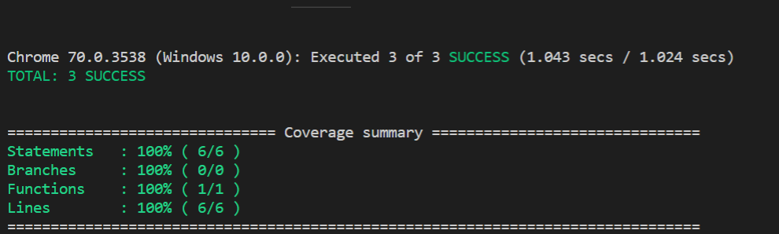

因为项目一直用的vue框架，所以来学习下vue项目如何写测试
官网推荐的套餐是karma+mocha+chai，因为我们都是用vue-cli脚手架搭建的，如果自己手动搭建测试环境的话，坑还是挺多的，想踩坑学习的自己去试一下， 我们关注的是如何写测试，不是怎么搭建测试环境，所以就用脚手架搭建了
1. 全局安装vue-cli `npm install vue-cli -g`
2. 初始化一个vue项目`vue int webpack vue-test`
3. set up unit tests的时候选择Y, 并且选择karam + mocha
4. 接下来安装karma-chrome-launcher, 在命令行中输入
`npm install karma-chrome-launcher --save-dev`
然后在项目中找到test/unit/karma.conf.js文件, 将PhantomJS浏览器修改为Chrome)
```javascript
//karma.conf.js

var webpackConfig = require('../../build/webpack.test.conf')

module.exports = function (config) {
  config.set({
    //browsers: ['PhantomJS'],
    browsers: ['Chrome'],    
    
    ...
  })
}
```

5. 在components目录下新建Counter.vue

```html
<template>
    <div>
      <div class="num"></div>{{ count }}
      <button @click="increment">自增</button>
      <button @click="incrementByAsync">异步自增</button>
    </div>
</template>
<script>
export default {
  data () {
    return {
      count: 0
    }
  },
  methods: {
    increment () {
      this.count++
    },
     incrementByAsync () {
        setTimeout(() => {
          this.count++ 
        }, 1000) 
      }
  }
}
</script>
```
在test/unit/specs目录下新建Counter.spec.js
```javascript
import Vue from 'vue'
import Counter from '@/components/Counter'
escribe('Counter.vue', () => {
    it('点击按钮后, count的值应该为1', () => {
      //获取组件实例
      const Constructor = Vue.extend(Counter) 
      //挂载组件
      const vm = new Constructor().$mount() 
      //获取button
      const button = vm.$el.querySelector('button') 
      //新建点击事件
      const clickEvent = new window.Event('click') 
      //触发点击事件
      button.dispatchEvent(clickEvent) 
      //监听点击事件
      vm._watcher.run() 
      // 断言:count的值应该是数字1
      expect(Number(vm.$el.querySelector('.num').textContent)).to.equal(1) 
    })
    it('count异步更新, count的值应该为1', (done) => {
        ///获取组件实例
        const Constructor = Vue.extend(Counter) 
        //挂载组件
        const vm = new Constructor().$mount() 
        //获取button
        const button = vm.$el.querySelectorAll('button')[1] 
        //新建点击事件
        const clickEvent = new window.Event('click') 
    
        //触发点击事件
        button.dispatchEvent(clickEvent) 
        //监听点击事件
        vm._watcher.run() 
        //1s后进行断言
        window.setTimeout(() => {
          // 断言:count的值应该是数字1
          expect(Number(vm.$el.querySelector('.num').textContent)).to.equal(1) 
          done() 
        }, 1000) 
      })
  
  })
```
执行`npm run unit`,结果如下


6. vue-test-utils

vue官方给我们提供了vue-test-utils，用它来写测试会变的非常方便
+ 首先安装`npm install vue-test-utils --save-dev`
+ 在测试脚本中引入vue-test-utils
  ```javascript
    //Counter.spec.js

    import Vue from 'vue'
    import Counter from '@/components/Counter'
    //引入vue-test-utils
    import {mount} from 'vue-test-utils'
  ```
+ 测试文本内容

 在Counter.spec.js测试脚本中对Counter.vue中h2的文本内容进行测试, 

未使用vue-test-utils的测试用例:
```javascript
  it('未使用Vue-test-utils: 正确渲染h2的文字为Counter.vue', () => {
    const Constructor = Vue.extend(Counter)
    const vm = new Constructor().$mount()
    const H2 = vm.$el.querySelector('h2').textContent
    expect(H2).to.equal('vue')
  })
```

使用了vue-test-utils的测试用例:
```javascript
it('使用Vue-test-Utils: 正确渲染h2的文字为vue', () => {
    const wrapper = mount(Counter) 
    expect(wrapper.find('h2').text()).to.equal('vue')
})
```
从上面的代码可以看出, vue-test-utils工具将该测试用例的代码量减少了一半, 如果是更复杂的测试用例, 那么代码量的减少将更为突出.  它可以让我们更专注于去写文件的测试逻辑, 将获取组件实例和挂载的繁琐的操作交由vue-test-utils去完成.
+ vue-test-utils的常用API
  * find(): 返回匹配选择器的第一个DOM节点或Vue组件的wrapper, 可以使用任何有效的选择器
  * text(): 返回wrapper的文本内容
  * html(): 返回wrapper DOM的HTML字符串
```javascript
  it('find()/text()/html()方法', () => {
    const wrapper = mount(Counter)
    const h2 = wrapper.find('h2')
    expect(h2.text()).to.equal('vue')
    expect(h2.html()).to.equal('<h2>vue</h2>')
  })
```

trigger(): 在该 wrapper DOM 节点上触发一个事件。
```javascript
it('trigger()方法', () => {
    const wrapper = mount(Counter)
    const buttonOfSync = wrapper.find('.syncbutton') 
    buttonOfSync.trigger('click')
    buttonOfSync.trigger('click')
    const count = Number(wrapper.find('.num').text()) 
    expect(count).to.equal(2)
  })
```

setData(): 设置data的属性并强制更新
```javascript
  it('setData()方法',() => {
    const wrapper = mount(Counter) 
    wrapper.setData({foo: 'bar'}) 
    expect(wrapper.vm.foo).to.equal('bar') 
  })
  ```
  将上面的测试整理到一个测试套件中, 在Counter.spec.js中添加下面的代码，重新执行npn run unit, 测试通过
  ```javascript
  import {mount} from 'vue-test-utils'
  describe('使用vue-test-util来测试Counter', () => {
  it('使用Vue-test-Utils: 正确渲染h2的文字为vue', () => {
    const wrapper = mount(Counter)
    expect(wrapper.find('h2').text()).to.equal('vue')
  })
  it('find()/text()/html()方法', () => {
    const wrapper = mount(Counter)
    const h2 = wrapper.find('h2')
    expect(h2.text()).to.equal('vue')
    expect(h2.html()).to.equal('<h2>vue</h2>')
  })
  it('trigger方法', () => {
    const wrapper = mount(Counter)
    const buttonOfSync = wrapper.find('.syncbutton')
    buttonOfSync.trigger('click')
    buttonOfSync.trigger('click')
    const count = Number(wrapper.find('.num').text())
    expect(count).to.equal(2)
  })
  it('setData()方法', () => {
    const wrapper = mount(Counter)
    wrapper.setData({foo: 'bar'})
    expect(wrapper.vm.foo).to.equal('bar')
  })
})
```

[回到首页](../README.md/#前端测试教程)